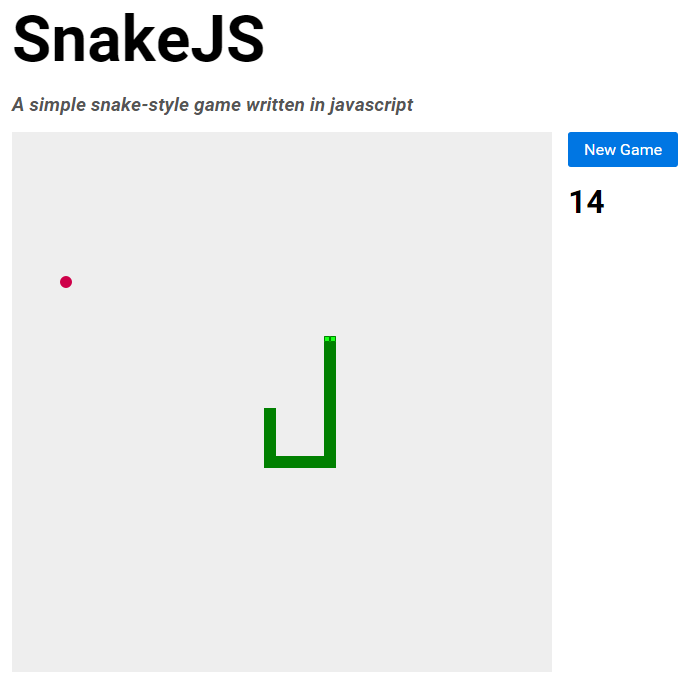

# snakejs

snake js is a simple snake-style game written purely in javascript, for fun. It's not intended to be perfectly cross-browser compatible, though reasonable attempt will be made to do so. This is mostly a personal project to get my head around working with javascript more.



For ease of development and testing, I've bundled it with a gemfile containing jekyll so people can get it running in a browser quickly. 

# Installation

Make sure you have a working version of Ruby installed, with the Bundler gem.

Clone snakejs and navigate to the folder:

```
git clone https://github.com/bluefantail/snakejs.git
cd snakejs
```

Install dependencies (Jekyll) using bundler:

```
$ bundle install
```

After Jekyll is installed run:

```
$ jekyll serve
```

snakejs should be available at http://localhost:4000


# Configuration

A few things can be changed to modify snakejs

### Styles

Config at the top of [snake.scss](assets/stylesheets/snake.scss) contains variables to modify sizes and colours.

Use `$tile-size` to set the size of a tile. 

`$game-width` and `$game-height` will then multiply with `$tile-size` to produce the grid.

Eg. `$tile-size: 10px;` and `$game-width: 50;`, `$game-height: 50;`, will produce a 500px x 500px grid with 10px x 10px tiles.   
```
// Game
$tile-size: 12px; // Default 12px
$game-width: 45; // Default 45
$game-height: 45; // Default 45
```

Colours should be fairly self explanatory.
```
// Colours
$blue: #0076E3;
$food: #CE0049;
$snake: green;
```

### Game Variables

Set the initial snake length, and game speed with these at the top of [snake.js](assets/javascripts/snake.js)
```
var startLength = 6; // Starting snake length
var gameSpeed = 60; // Set the game movement speed in milliseconds
```